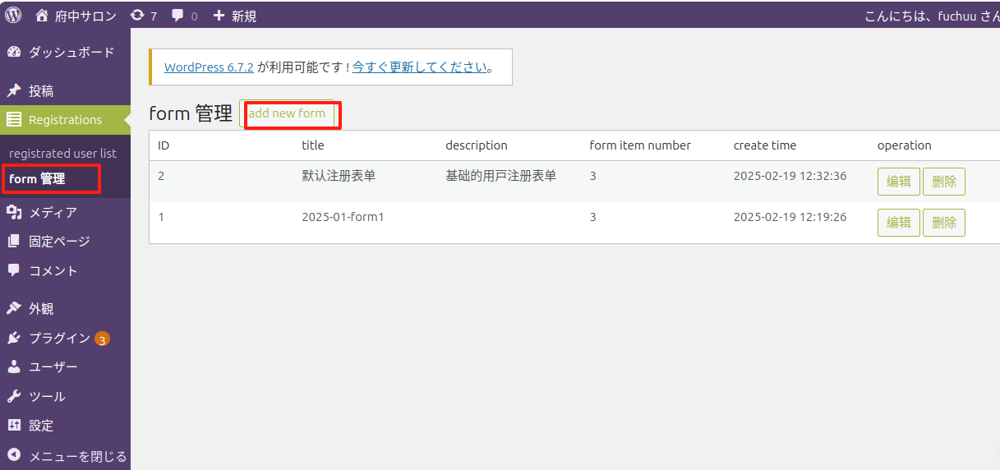
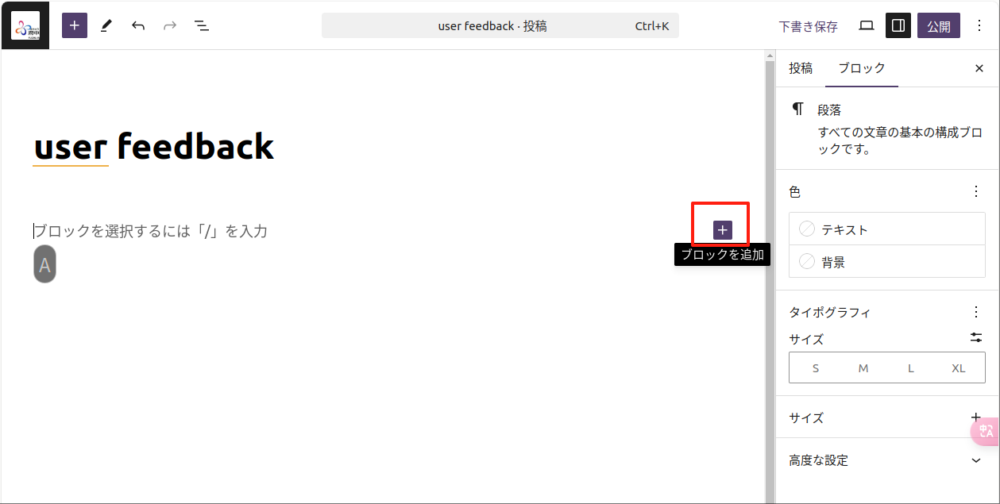
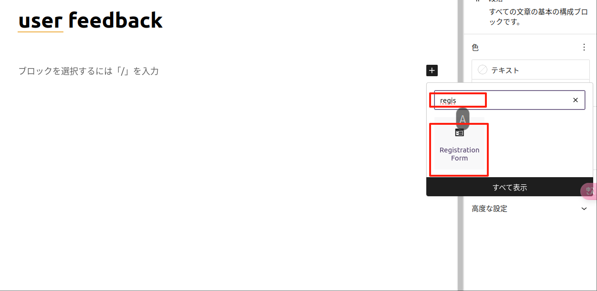
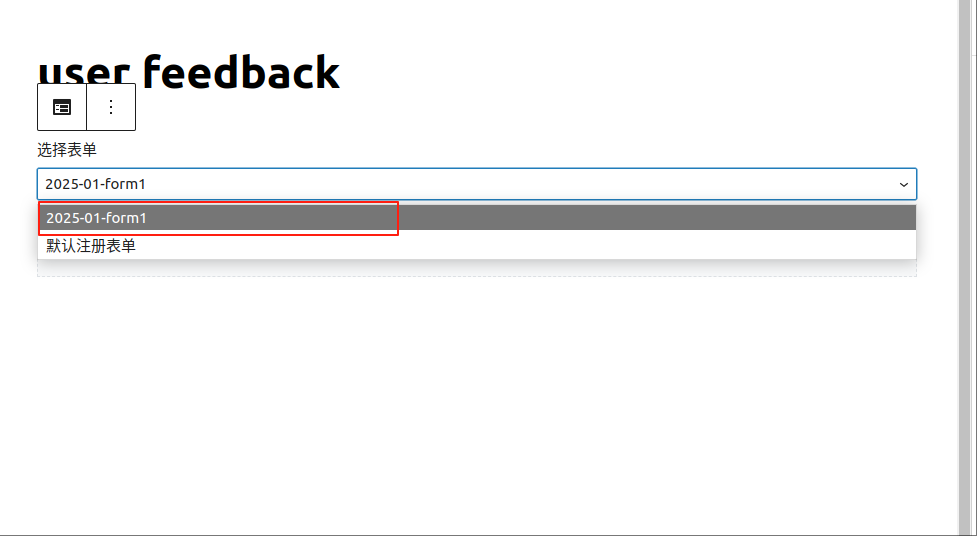
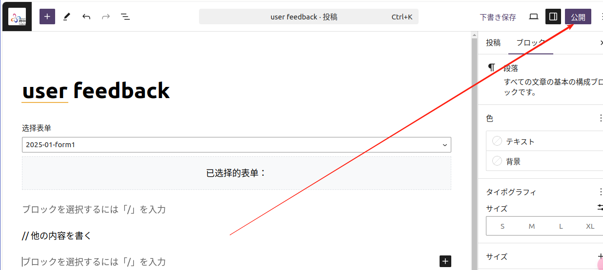
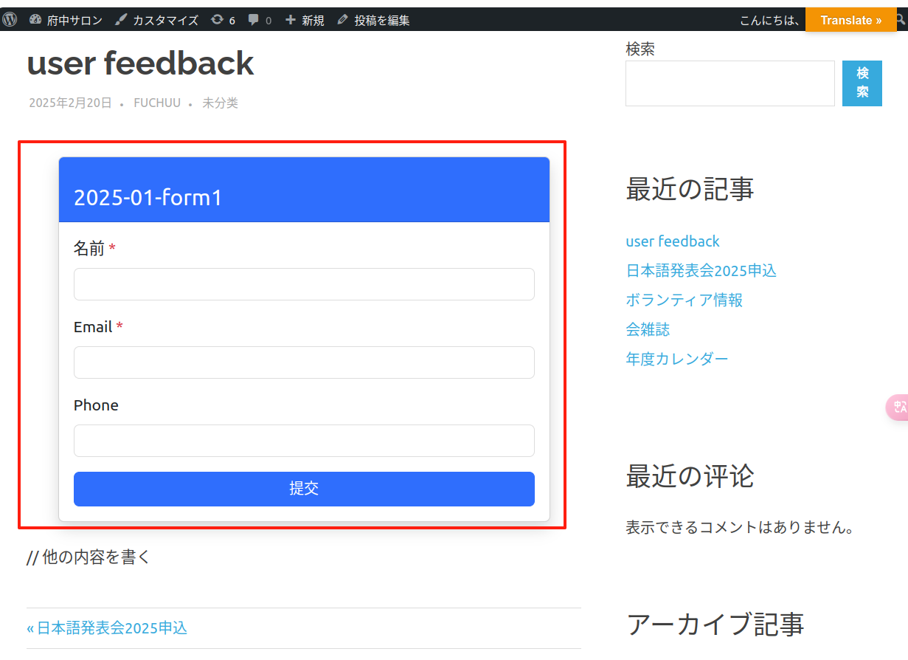

# user registration plugin
活動について ユーザーが登録することができる。

## 使用する
### install
* この repo を zip ファイルにする
* この zip ファイルを WordPress の プラグイン にアップロードする
* プラグインを有効化する
* プラグインの設定画面で、必要な設定を行う

### form を設定
* プラグインの設定画面で、必要な設定を行う



文章の中で使用できます：



コンポを検索する：



使用するフォームを選択してください:



コンテンツを編集したら保存または公開します



その後、フロントページを表示でき、フォームが正しく表示されます

   


## ref
- https://developer.wordpress.org/reference/classes/wpdb
- 人人都能学会的 WordPress 实战课 https://www.easywpbook.com/plugin
- WordPress中文手册 https://www.dba.cn/book/wordpress/

## other

```
=== User Registration Form ===
Contributors: suhanyujie | [HomePage](https://github.com/suhanyujie/wp-plugin-user-reg)
Tags: 登録フォーム, registration
Requires at least: 6.7.1
Tested up to: 6.7.1
Requires PHP: 8.2
Stable tag: 0.1.1
License: GPLv2 or later
License URI: https://www.gnu.org/licenses/gpl-2.0.html

登録すること

== Description ==
活動について ユーザーが登録することができる。


== Installation ==
4. 使用插件
将 `user-registration-form` 文件夹上传到 `wp-content/plugins/`。

登录 WordPress 后台，进入 插件 > 已安装的插件，找到并启用 `User Registration Form`。

在页面或文章中选择组件 `Registration Form`，并选择表单，从而在前台页面中显示表单。

在 WordPress 后台的 `Registrations` 菜单中查看申请的用户列表。

== Docs and support ==
[Docs](https://github.com/suhanyujie/wp-plugin-user-reg)
[Support](https://github.com/suhanyujie/wp-plugin-user-reg/issues)

== Frequently Asked Questions ==

```